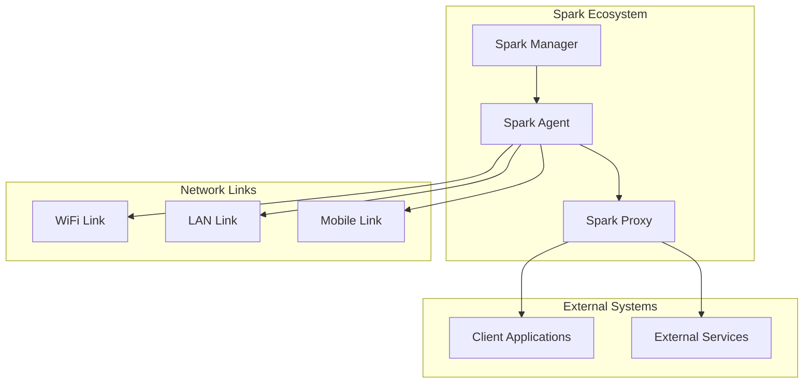

# Spark™

> **Intelligent Message Spark Across Multiple Network Links**

Spark is a robust, enterprise-grade message transmission system that intelligently routes messages across multiple network links (WiFi, LAN, Mobile) with automatic failover, priority-based queuing, and real-time link quality assessment.

---

## 🌟 **Key Features**

### 🚀 **Core Capabilities**
- **Multi-Link Support** - Simultaneous WiFi, LAN, and Mobile connectivity
- **Intelligent Routing** - Automatic best-link selection based on quality metrics
- **Priority Queuing** - 4-level message prioritization (CRITICAL → HIGH → MEDIUM → LOW)
- **Fault Tolerance** - Circuit breaker pattern with automatic failover
- **Real-time Monitoring** - Live link quality assessment and performance metrics

### 🛡️ **Reliability Features**
- **Message Persistence** - Local caching with priority-based retrieval
- **Retry Logic** - Configurable retry attempts with exponential backoff
- **Health Monitoring** - Continuous link availability and bandwidth testing
- **Configuration Sync** - Centralized configuration with offline fallback modes

### 🎛️ **Management & Control**
- **Centralized Management** - SparkManager for multi-agent coordination
- **RESTful APIs** - Complete API suite for integration and monitoring
- **Real-time Dashboard** - WebSocket-based live status updates
- **Discovery Service** - Automatic agent discovery via LAN/WAN broadcasting

---

## 🏗️ **System Architecture**



### **Core Components**

| Component | Purpose | Port | Description |
|-----------|---------|------|-------------|
| **Spark Agent** | Message Processing | 3000 | Main agent for message handling and transmission |
| **Spark Manager** | Centralized Control | 9000 | Configuration management and agent coordination |
| **Spark Proxy** | Message Forwarding | 8080/8081 | HTTP/WebSocket proxy for external systems |

---

## 🚀 **Quick Start**

### **Prerequisites**
- Node.js 18+ 
- TypeScript 5.1+
- Windows/Linux/macOS

### **Installation**

```bash
# Clone the repository
git clone https://gitlab.com/israelways/spark.git
cd spark

# Install dependencies
npm install

# Build the project
npm run build
```

### **Configuration**

Create configuration files:

```bash
# Create config directory
mkdir config

# Agent configuration
cat > config/agent-config.json << EOF
{
  "apiPort": 3000,
  "sparkProxyUrl": "http://localhost:8080/api/messages",
  "sparkManagerUrl": "http://localhost:9000",
  "defaultToken": "your-secure-token-here"
}
EOF
```

### **Running the System**

```bash
# Start all components
npm start all

# Or start individually
npm start manager    # Spark Manager
npm start proxy      # Spark Proxy  
npm start agent      # Spark Agent

# Development mode
npm run dev
```

---

## 📡 **API Reference**

### **Agent API (Port 3000)**

#### Send Message
```http
POST /api/messages
Authorization: Bearer <token>
Content-Type: application/json

{
  "content": "Your message content",
  "priority": 3
}
```

#### Get Status
```http
GET /api/status
Authorization: Bearer <token>
```

**Response:**
```json
{
  "id": "agent-uuid",
  "status": "active",
  "selectedLink": "wifi",
  "schedulerMode": "continuous",
  "messagesInQueue": 5,
  "linkQualities": [
    {
      "type": "wifi",
      "available": true,
      "bandwidth": 75,
      "latency": 25,
      "reliability": 0.95
    }
  ]
}
```

### **Manager API (Port 9000)**

#### Get Configuration
```http
GET /api/configuration
```

#### Update Agent Configuration
```http
POST /api/agents/{agentId}/configuration
Content-Type: application/json

{
  "schedulerMode": "interval",
  "selectedLink": "lan",
  "intervalMs": 10000
}
```

---

## 🔧 **Configuration**

### **Message Priorities**

| Priority | Value | Use Case |
|----------|-------|----------|
| CRITICAL | 4 | Emergency alerts, system failures |
| HIGH | 3 | Important notifications, alerts |
| MEDIUM | 2 | Regular business messages |
| LOW | 1 | Background data, logs |

### **Scheduler Modes**

- **Continuous**: Real-time message processing (100ms intervals)
- **Interval**: Batch processing at configured intervals

### **Link Types**

- **WiFi**: Wireless network connectivity
- **LAN**: Wired ethernet connection  
- **Mobile**: Cellular data connection

---

## 📊 **Monitoring & Observability**

### **Logging**

Spark uses structured logging with Winston:

```bash
# Log locations
logs/
├── Spark-Agent.log
├── Spark-Manager.log
├── Spark-Proxy.log
└── errors/
    ├── Spark-Agent-error.log
    ├── Spark-Manager-error.log
    └── Spark-Proxy-error.log
```

### **Health Checks**

```bash
# Agent health
curl http://localhost:3000/api/status

# Manager health  
curl http://localhost:9000/health

# Proxy health
curl http://localhost:8080/health
```

### **Metrics**

- Message throughput per link
- Link quality scores (bandwidth, latency, reliability)
- Queue sizes by priority
- Retry rates and failure counts
- System resource utilization

---

## 🧪 **Testing**

```bash
# Run all tests
npm test

# Run with coverage
npm run test:coverage

# Integration tests
npm run test:integration

# Load testing
npm run test:load
```

### **Test Message Sending**

```bash
# Send test message
curl -X POST http://localhost:3000/api/messages \
  -H "Authorization: Bearer $(curl -s http://localhost:3000/api/token | jq -r '.token')" \
  -H "Content-Type: application/json" \
  -d '{"content": "Test message", "priority": 2}'
```

---

## 🔄 **Deployment**

### **Docker Deployment**

```bash
# Build images
docker build -t Spark:latest .

# Run with docker-compose
docker-compose up -d
```

### **Production Considerations**

- **Load Balancing**: Deploy multiple agents behind a load balancer
- **High Availability**: Run Manager and Proxy in cluster mode  
- **Security**: Use TLS/SSL for all communications
- **Monitoring**: Integrate with Prometheus/Grafana
- **Backup**: Regular configuration and state backups

---

## 🛠️ **Development**

### **Project Structure**

```
Spark/
├── src/
│   ├── agent/              # Spark Agent
│   ├── manager/            # Spark Manager  
│   ├── proxy/              # Spark Proxy
│   ├── core/               # Core business logic
│   ├── adapters/           # Link adapters
│   ├── api/                # API layer
│   ├── utils/              # Utilities
│   └── types/              # TypeScript definitions
├── config/                 # Configuration files
├── logs/                   # Application logs
├── tests/                  # Test suite
├── docs/                   # Documentation
└── docker/                 # Docker configurations
```

### **Contributing**

1. Fork the repository
2. Create a feature branch (`git checkout -b feature/amazing-feature`)
3. Commit changes (`git commit -m 'Add amazing feature'`)
4. Push to branch (`git push origin feature/amazing-feature`)
5. Open a Merge Request

### **Code Standards**

- **TypeScript**: Strict mode enabled
- **Linting**: ESLint with Airbnb configuration
- **Formatting**: Prettier with 2-space indentation
- **Testing**: Jest for unit tests, Supertest for API tests
- **Documentation**: JSDoc for all public methods

---

## 🔐 **Security**

### **Authentication**
- Token-based authentication for all API endpoints
- Configurable token rotation
- Rate limiting on API endpoints

### **Network Security**
- TLS 1.3 for all communications
- Network-level firewalls
- VPN support for remote deployments

### **Data Protection**
- Message encryption in transit
- Secure configuration storage
- Audit logging for all operations

---

## 📈 **Performance**

### **Benchmarks**

| Metric | Performance |
|--------|-------------|
| Messages/sec | 1,000+ |
| Latency (avg) | <50ms |
| Memory Usage | <100MB |
| CPU Usage | <5% idle |

### **Optimization Tips**

- Use `continuous` mode for low-latency requirements
- Use `interval` mode for high-throughput batch processing
- Tune retry settings based on network conditions
- Monitor and adjust link quality thresholds

---

## 🆘 **Troubleshooting**

### **Common Issues**

#### Agent Won't Start
```bash
# Check configuration
cat config/agent-config.json

# Verify Manager connectivity
curl http://localhost:9000/health

# Check logs
tail -f logs/Spark-Agent.log
```

#### Messages Not Sending
```bash
# Check link status
curl -H "Authorization: Bearer <token>" http://localhost:3000/api/status

# Verify Proxy connectivity
curl http://localhost:8080/health

# Check queue status
grep "queue" logs/Spark-Agent.log
```

#### Configuration Sync Failing
```bash
# Check Manager availability
curl http://localhost:9000/api/configuration

# Verify network connectivity
ping your-manager-host

# Check sync logs
grep "sync" logs/Spark-Agent.log
```

---

## 📚 **Documentation**

- **[API Documentation](docs/api.md)** - Complete API reference
- **[Deployment Guide](docs/deployment.md)** - Production deployment
- **[Architecture Guide](docs/architecture.md)** - Detailed system design
- **[Configuration Reference](docs/configuration.md)** - All configuration options
- **[Troubleshooting Guide](docs/troubleshooting.md)** - Common issues and solutions

---

## 🏷️ **Version**

**Current Version**: `v1.0.0`

**Release Notes**: [CHANGELOG.md](CHANGELOG.md)

---